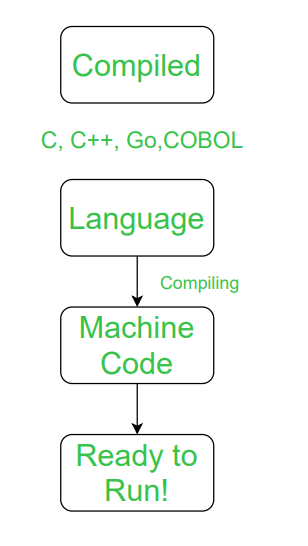
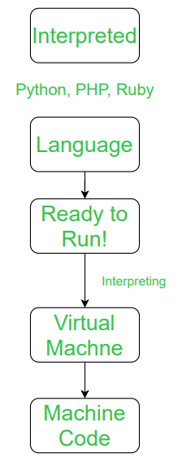

### Verify people have everything setup
1. Visual Studio Code
2. c# extensions
3. dontnet sdks and runtime  
    ``` dotnet --list-sdks```  
    ``` dotnet --list-runtimes```  
4. Git bash
    https://git-scm.com/downloads
5. Change vscode to use gitbash
    ``` ctrl + `  ```  
    ``` ctrl + shift + p ```
    ``` select gitbash ```

6. Open new folder in vscode
7. Instal Roslynator via vs code extension
8. Show themes

## Boring Lecture Part

* What is .dotnet
    * a framework designed by microsoft
    * crossplatform
    * built in libraries
    * General purpose langauge
    * statically typed
        * In a statically typed language, data types are defined during compile time and cannot change during runtime
    * compiled
        *  
    * interpted 
        * 
        * source https://www.geeksforgeeks.org/difference-between-compiled-and-interpreted-language/
    * What can you build using .dotnet
        * Console app - terminal apps
        * Web Apps
            * we will learn blazor
        * Desktop Apps
        * Video Games
    * DotNet Documentation
        * https://learn.microsoft.com/en-us/dotnet/
    
## Programming 

1. create first program  
    ```bash  
    mkdir HelloWorld
    cd HelloWorld
    dotnet new console
    ```
    This uses dotnet templates there are many. Can find list on google or by using the command line tool
    ``` dotnet new list```
    https://learn.microsoft.com/en-us/dotnet/core/tools/dotnet-new-sdk-templates
2. Create first program using explicits
    ```bash  
    mkdir HelloWorldExplicit
    cd HelloWorldExplicit
    dotnet new console --use-program-main
    ```
    
    ```C# 
    namespace HelloDotNetExplicit;

    class Program
    {
        static void Main(string[] args)
        {
            Console.WriteLine("Hello, World!");
        }
    }
    ```
    * Namespace - name of project
    * internal - access modifier 
    * class - wrap content with curly braceout
    * program class 
    * void - doesn't return a value
    * Console is a method
3. Program Arguments
    ```bash  
    mkdir ProgramArgsExplicit
    cd ProgramArgsExplicit
    dotnet new console --use main-program
    ```
    * you can pass in arguments into a function like so  
    ```c#
        namespace ProgramArmsExplicit
        {
            internal class Program
            {
                static void Main(string[] args)
                {
                    Console.WriteLine(args[0]);
                }
            }
    }

    ```
    * ``` dotnet run jake``` in your console  
    * output should look like this 
    ``` 
    Jacob Baggs@DESKTOP-BBD74IS MINGW64 ~/Documents/LearnCSharp/lesson1/ProgramArmsExplicit
    $ dotnet run jake
    jake
    ```
    * Program Arms nonexplicit
    ```bash  
    mkdir ProgramArgs
    cd ProgramArgs
    dotnet new console
    ```
    ```c#
    Console.WriteLine(args[0]);

    ```
    ```
    Jacob Baggs@DESKTOP-BBD74IS MINGW64 ~/Documents/LearnCSharp/lesson1/ProgramArgs
    $ dotnet run jake
    jake
    ```

3. [CheatSheet](https://zerotomastery.io/cheatsheets/csharp-cheat-sheet/)
